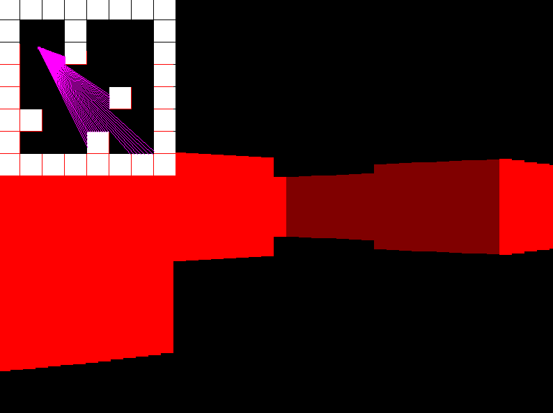

# Raycaster in C++

A small 2D raycasting engine project made to train and know more about *c++* and also *cmake*

**Note** - The engine is really simple and there are things that are probably not coded in the best way, also the cmake file might not be set up properly, since im still discovering all this, so it might not work out of the box and maybe you'd need to make your own changes. With that said **Use it at your own risk!**

## Example application

 

## Building

 - C++ 17 and at least CMake 3.14 is required
 - You need also to have [SDL2](https://www.libsdl.org/download-2.0.php) installed on your computer

## Things to do

 - [ ] Ceiling and sky
 - [ ] Add Textures
 - [ ] Object Sprites
 - [ ] Collisions
## References

I saw a lot of interesting tutorials on this topic and I will share it here if you're interested:

 - [Make your own Raycaster Part 1](https://www.youtube.com/watch?v=gYRrGTC7GtA)
    - by [3DSage](https://www.youtube.com/c/3DSage)
 - [Lode's Computer Graphics Tutorial](https://lodev.org/cgtutor/raycasting.html)
    - by [Lode Vandevenne](https://lodev.org/)
 - [Super Fast Ray Casting in Tiled Worlds using DDA](https://www.youtube.com/watch?v=NbSee-XM7WA)
    - by [javidx9](https://www.youtube.com/channel/UC-yuWVUplUJZvieEligKBkA)

